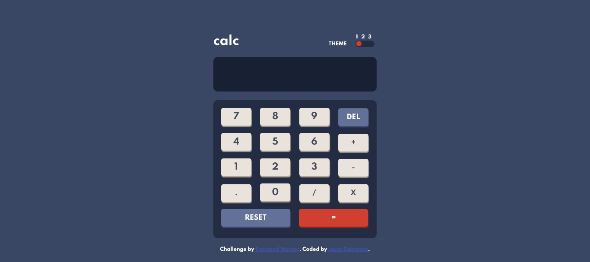

# Frontend Mentor - Calculator app solution

This is a solution to the [Calculator app challenge on Frontend Mentor](https://www.frontendmentor.io/challenges/calculator-app-9lteq5N29). Frontend Mentor challenges help you improve your coding skills by building realistic projects. 

## Table of contents

- [Overview](#overview)
  - [The challenge](#the-challenge)
  - [Screenshot](#screenshot)
  - [Links](#links)
- [My process](#my-process)
  - [Built with](#built-with)
  - [What I learned](#what-i-learned)
  - [Continued development](#continued-development)
  - [Useful resources](#useful-resources)
- [Author](#author)
- [Acknowledgments](#acknowledgments)

## Overview

### The challenge

Users should be able to:

- See the size of the elements adjust based on their device's screen size
- Perform mathmatical operations like addition, subtraction, multiplication, and division
- Adjust the color theme based on their preference
- **Bonus**: Have their initial theme preference checked using `prefers-color-scheme` and have any additional changes saved in the browser

### Screenshot

### Links

- Solution URL: [https://github.com/JesseOlisa/calculator-app-main]
- Live Site URL: [https://jesseolisa.github.io/calculator-app-main/]

## My process

### Built with

- Semantic HTML5 markup
- CSS custom properties
- Flexbox
- JavaScript

### What I learned

I learnt so much after watching the JavaScript part of Justin Kim's calculator tutorial video. I used what i learnt to complete this app

### Continued development

After watching several tutorial videos I was able to complete this calculator web app;
I picked up several javascript syntaxes along the way.
So, going forward i will continue to enhance my skills in Javascript to continue to build more web apps.

### Useful resources

- [Build an iPhone Calculator using HTML CSS & JavaScript!](https://youtu.be/h6UPzVj1ncI) - This iphone calculator tutorial from Justin Kim helped to create this calculator web app.

## Author

- Frontend Mentor - [https://www.frontendmentor.io/profile/JesseOlisa]
- Twitter - [https://www.twitter.com/yourusername/jesseOlisa]

## Acknowledgments

Justin Kim - Your tutorial video really helped me alot. Thank you!

